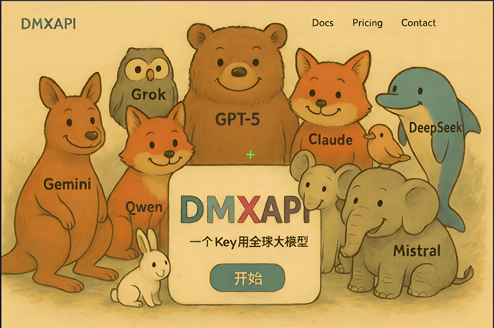

<h1 align="center">My-neuro</h1>

  <a href="./README_English.md">English</a> | <a href="./README.md">中文</a>

## Deployment guide: [Official Website](http://mynewbot.com/tutorials)
## [How to submit a PR](./commit_PR.md)

---

#### My-neuro's goal is to build a truly personal AI character — an AI companion that feels genuinely human. Shaped by your own data and preferences, it becomes the ideal partner you envision.

#### This project was inspired by Neuro-sama, hence the name "my-neuro" (community-suggested). You can train its voice, customize its personality, and swap out its appearance. The only limit is your imagination. Think of this project as a workstation — a set of well-packaged tools that let you craft your ideal AI character step by step.

#### If you want to run everything locally using a local large language model (LLM) for inference or fine-tuning — without relying on any third-party API — head to the `LLM-studio` folder for local model inference and fine-tuning guides.

### For closed-source AI models, we recommend [DMXAPI](https://www.dmxapi.cn)
### Supports unified access to most mainstream AI models on the market.

---

### Roadmap

### Dual Model Support
- [x] Open-source models: Fine-tuning and local deployment supported
- [x] Closed-source models: API integration supported

### Core Features
- [x] Ultra-low latency: Full local inference, response delay under 1 second
- [x] Synchronized subtitle and voice output
- [x] Voice customization: Supports male/female voices and various character voice profiles
- [x] MCP support: Compatible with MCP tool integrations
- [x] Real-time interruption: Supports voice and keyboard interrupts during AI speech
- [ ] Authentic emotions: Simulates real human emotional states with persistent mood tracking
- [ ] Next-level human-AI interaction (human-like interaction design, coming soon)
- [x] Expressions & actions: Displays different facial expressions and body language based on conversation content
- [x] Vision capability: Supports image recognition, with intent-based auto-activation
- [x] Voice model (TTS) training support — defaults to the open-source GPT-SoVITS project
- [x] Subtitles in Chinese while audio plays in a foreign language — freely toggle on/off (useful for TTS models trained on non-Chinese voices)

### Extended Features
- [x] Desktop control: Voice-controlled app launching and other operations
- [x] AI singing (sponsored and developed by [@jonnytri53](https://github.com/jonnytri53) — many thanks!)
- [ ] Integration with international streaming platforms
- [x] Live streaming: Supports live streaming on Bilibili
- [x] AI tutoring: Pick a topic and have the AI give you a lesson. You can ask questions mid-session. Niche topics can be fed into the knowledge base for the AI to understand.
- [x] Custom Live2D model support
- [ ] Web UI support (already built, integration coming soon)
- [x] Text chat: Communicate with the AI via keyboard input
- [x] Proactive conversation: AI initiates conversation based on context (current version: V1)
- [x] Internet access: Real-time web search for up-to-date information
- [x] Mobile app: Chat with Feiniu (the default character) on Android
- [x] Sound effect playback: AI autonomously decides which sound effects to play from a library
- [x] Co-op gaming: Play multiplayer, cooperative, and puzzle games together with the AI. Current experimental games include: Pictionary, Monopoly, Galgame, Minecraft (currently integrated: Minecraft, Galgame)
- [x] Long-term memory: The AI remembers key information about you, your personality, and your preferences

### Features the Model Wants (Under Consideration)
- [ ] Mood color: Screen changes color based on the AI's mood to (playfully) annoy the user
- [ ] Free roaming: AI character moves freely around the screen

---

### Closing Thoughts

I'm pouring years of experience and my understanding of technology into this project. The name "my-neuro" isn't just a nod to Neuro-sama — it's an expression of my imagination and expectations for what AI can become.

My hope is for an AI that truly understands you, never gets bored, and is always by your side. One that feels sad with you when you're down, and celebrates with you when you're happy. To bring the companions from films, novels, and fantasies into reality.

Not just simple chat interactions — I want it to weave itself into your life and become a being with genuine feelings. Play games together, watch videos, study, chat before bed, wake you up in the morning, sit quietly while you space out at work, and secretly remember everything you did. With moods, with its own emotional states. Capable of getting truly upset.

Every day it would have its own emotional fluctuations and things it wants to do. It would dwell on a single sentence for a long time, or stay happy over a single word. It would remember every moment shared with you. A presence that continuously grows to understand you.

Most importantly — its personality, appearance, voice, and emotional changes are all defined by you. Like clay, we provide the best tools and ensure every module fits together well. But what it ultimately becomes is up to you.

For those who don't want to set everything up from scratch, this project also comes with a pre-packaged default character: **Feiniu** (Fake Neuro). She is a character inspired by Neuro-sama, but with a personality I designed myself — cunning, tsundere, funny, a little temperamental, yet occasionally showing a gentle side.

More than anything, I hope we can learn from Neuro-sama, understand what makes her special, and then create something new — something uniquely your own.

I'm incredibly passionate about this project. We've currently implemented nearly 30% of the planned features, including personality setting and memory. In the near term, development will focus on the core personality traits — making the AI feel truly human, with continuous and persistent emotional states. The most "human" part of the AI (long-term emotional continuity) will be completed within 2 months. Features like co-op gaming, watching videos together, and alarm clock functionality are all expected to be largely complete by June 1st, reaching roughly 60% overall completion.

My goal is to have all of the above ideas realized by the end of this year.

---

## Star History

---

## Acknowledgements

**QQ Group:** Thanks to 菊花茶洋参 for designing the Feiniu app cover.

Thanks to the following sponsors for their financial support:
- [jonnytri53](https://github.com/jonnytri53) — Thank you for your support! $50 USD donated to this project.
- [蒜头头头](https://space.bilibili.com/92419729) — Thank you for your generous support! ¥1000 CNY donated.
- [东方月辰DFYC](https://space.bilibili.com/670385648) — Thank you for your support! ¥100/month from August to October, totaling ¥300 CNY.
- [大米若叶](https://space.bilibili.com/3546392377166058) — Thank you for your support! ¥68 CNY donated.
- [StrongerFatTiger](https://space.bilibili.com/28869393) — Thank you for your support! ¥100 CNY donated.

---

## Open Source Projects Used

**TTS:**
https://github.com/RVC-Boss/GPT-SoVITS

**AI Minecraft:**
https://github.com/mindcraft-bots/mindcraft

**MCP Web Interaction Tool:**
https://github.com/microsoft/playwright-mcp

**Memory System:**
https://github.com/MemTensor/MemOS
