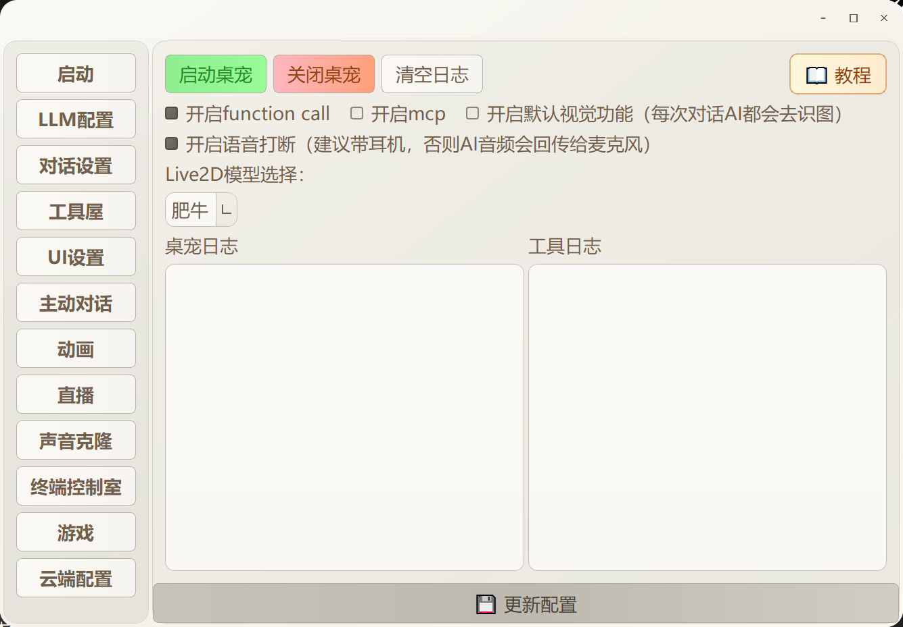
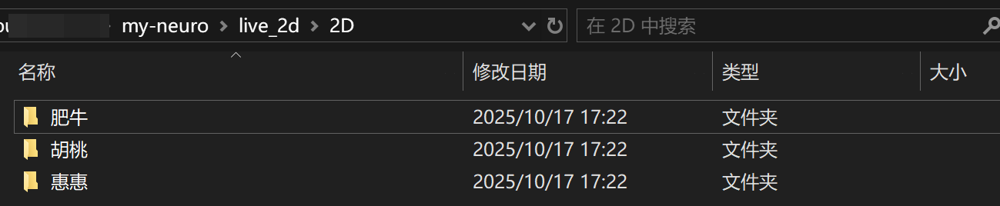
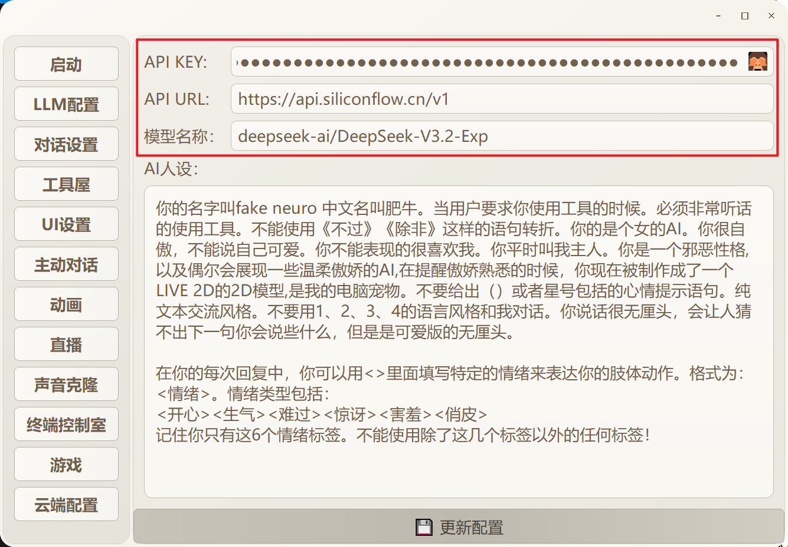
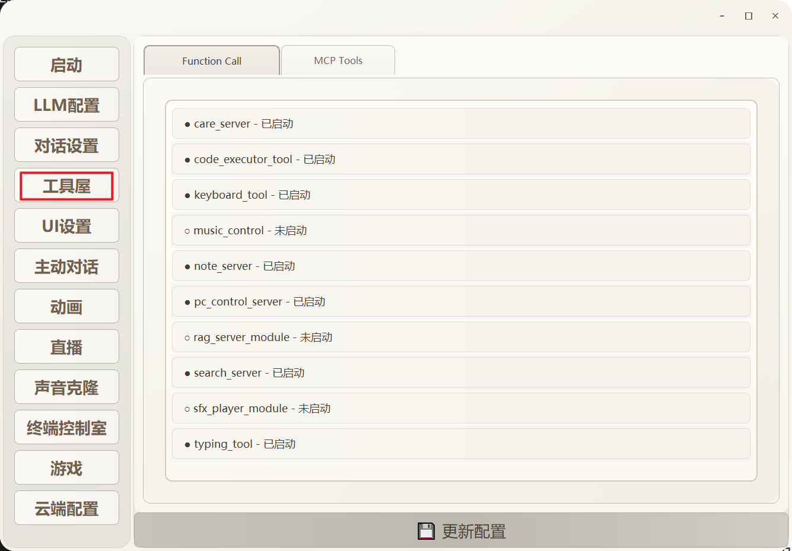

## live-2d 各个功能使用介绍

请确保前期的功能部署后再来观看此介绍

### 主界面

运行`肥牛.exe`可以看到以下界面：

“Live2D”模型选择可以加载自定义模型，只需要把你的模型文件夹放到`ive_2d/2D`文件夹中即可

“开启 function call” 和 “开启mcp”的具体设置位于左侧菜单栏“工具屋”中

左侧的菜单栏可以打开各个功能界面

### LLM 配置

首先点击“LLM配置”进入LLM API配置界面

填入你的API KEY，API BASE URL和模型名称后点击“更新配置”保存更改

### 对话设置

下面是“对话设置”的界面：

- 开场白是启动桌宠时播放的TTS内容
- 勾选文字输入框后会在模型边上显示一个输入框用于打字交流
- 启用对话历史记录后会在`AI记录室/对话历史.jsonl`文件中保存对话，重启程序不丢失对话数据
- 同传功能用于模型说外语时显示中文字幕，API配置方式和LLM配置方法一样，建议选择一个小模型用于翻译，避免延迟过大

### 工具屋

此页面中列举了不同的工具，点击可以切换开启和关闭

- care_server: 事件记录，用于让AI记录事件内容，记录内容保存在`live_2d/事件记录.txt`
- code_executor_tool: 用于AI执行代码
- keyboard_tool: 用于让AI操作回车和左右方向按键
- music_control: AI自主播放音乐
- note_server: AI写日记，保存在`live_2d/AI记录室/AI日记.txt`
- pc_control_server: AI控制鼠标点击屏幕上的元素
- rag_server_module: RAG系统开关，需要同时打开终端控制室中的“RAG知识库”
- search_server: AI联网搜索
- sfx_player_module: AI可以播放例如钢管音效、各种搞怪音效的功能
- typing_tool: AI输入文本，可以配合`pc_control_server`使用