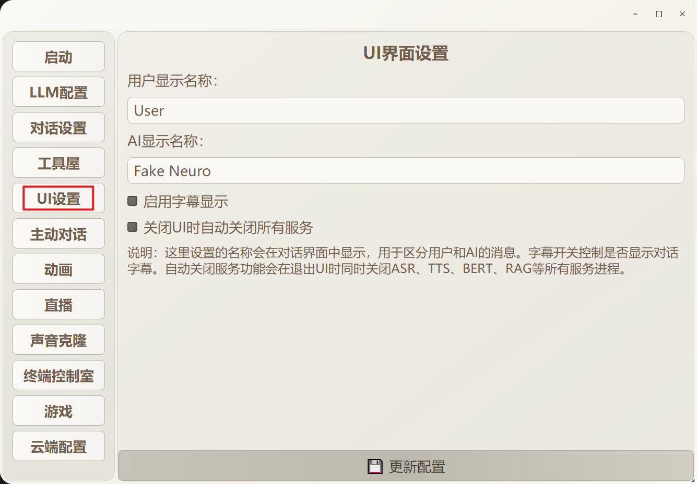

## live-2d 各个功能使用介绍

请确保前期的功能部署后再来观看此介绍

### 主界面

运行`肥牛.exe`可以看到以下界面：

“Live2D”模型选择可以加载自定义模型，只需要把你的模型文件夹放到`ive_2d/2D`文件夹中即可

“开启 function call” 和 “开启mcp”的具体设置位于左侧菜单栏“工具屋”中

左侧的菜单栏可以打开各个功能界面

### LLM 配置

首先点击“LLM配置”进入LLM API配置界面

填入你的API KEY，API BASE URL和模型名称后点击“更新配置”保存更改

### 对话设置

下面是“对话设置”的界面：

- 开场白是启动桌宠时播放的TTS内容
- 勾选文字输入框后会在模型边上显示一个输入框用于打字交流
- 启用对话历史记录后会在`AI记录室/对话历史.jsonl`文件中保存对话，重启程序不丢失对话数据
- 同传功能用于模型说外语时显示中文字幕，API配置方式和LLM配置方法一样，建议选择一个小模型用于翻译，避免延迟过大

### 工具屋

此页面中列举了不同的工具，点击可以切换开启和关闭

- care_server: 事件记录，用于让AI记录事件内容，记录内容保存在`live_2d/事件记录.txt`
- code_executor_tool: 用于AI执行代码
- keyboard_tool: 用于让AI操作回车和左右方向按键
- music_control: AI自主播放音乐
- note_server: AI写日记，保存在`live_2d/AI记录室/AI日记.txt`
- pc_control_server: AI控制鼠标点击屏幕上的元素
- rag_server_module: RAG系统开关，需要同时打开终端控制室中的“RAG知识库”
- search_server: AI联网搜索
- sfx_player_module: AI可以播放例如钢管音效、各种搞怪音效的功能
- typing_tool: AI输入文本，可以配合`pc_control_server`使用

### UI设置

- 用户显示名称：用户输入字幕显示时使用的昵称
- AI显示名称：AI回复字幕显示时使用的昵称
- 启用字幕显示：用户和AI的聊天内容会以字幕的形式展示在Live2D皮套边上
- 关闭UI时自动关闭所有服务：关闭此窗口后自动关闭后端服务

### 主动对话

“空闲时间”内用户未与AI对话时AI会开始自言自语

### 动画

用于匹配AI情绪和Live2D模型的动作，AI会根据情绪自动切换动作

### 直播

填写B站直播间ID后，AI会读取该直播间的弹幕数据并生成回复，期间用户仍可以与AI交互，AI能分清用户输入和直播间弹幕

### 声音克隆

本地训练TTS音色，选择模型文件和参考音频，输入角色名称，选择参考音频语言（支持中日英韩），填写参考音频文本后点击“生成TTS的bat文件”。训练好后可以在`my-neuro`根目录找到带有角色名称的 TTS bat 文件

### 终端控制室

使用本地算力时需要依次点击启动按钮

使用云端API请阅读后文

### 游戏

TK

### 云端配置

使用云端 TTS 和 ASR 需要勾选“启用云端TTS”和“启用云端ASR”，其中的配置已经填好，无需修改

特殊的，还需要在“终端控制室”中点击“启动ASR”，这会启动 VAD 用于检测用户是否说话