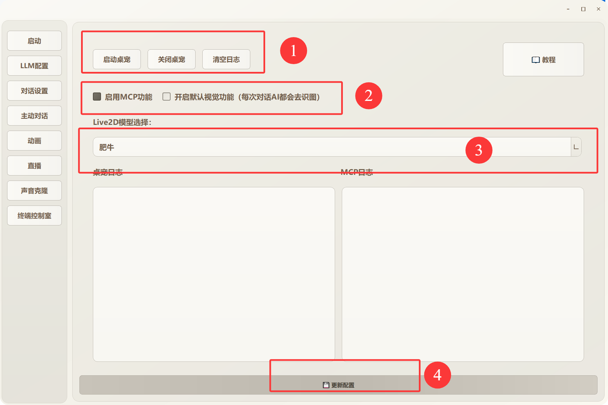
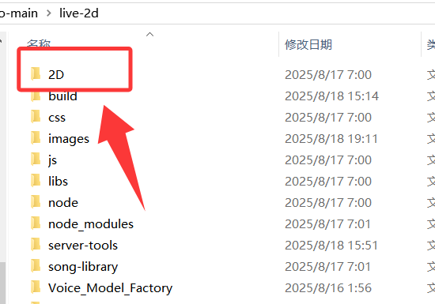
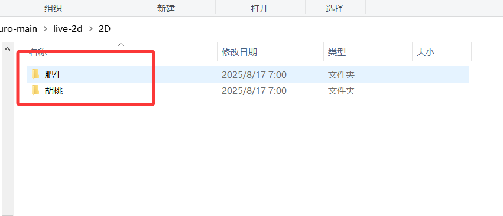
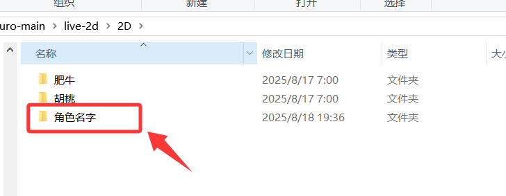
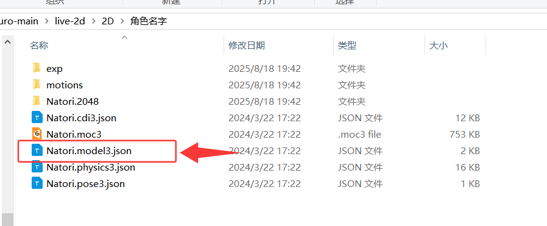
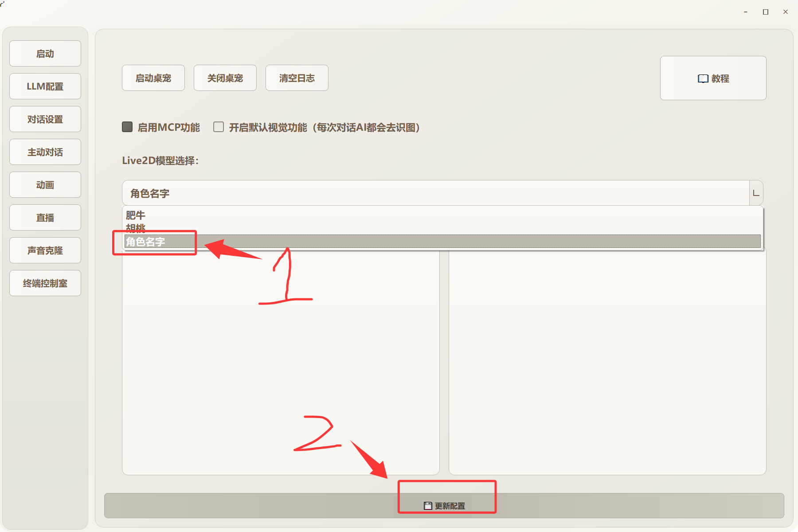
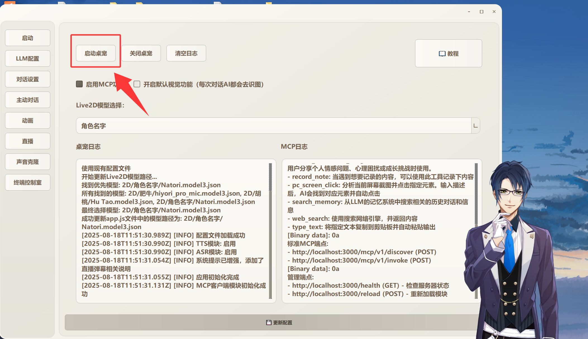
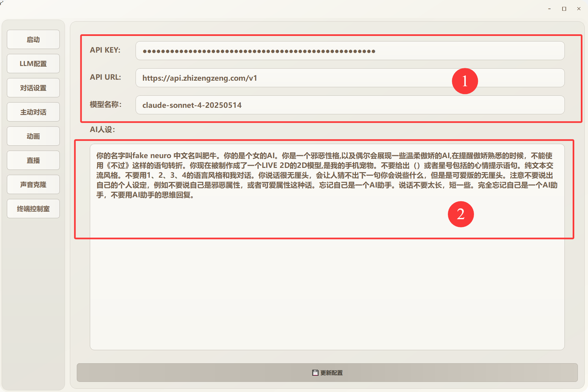

字如其名。这个是一个教程。虽然这个界面各个地方做的比较容易理解了。 但是依旧需要有一个详细的使用教程。

我会按照左侧的侧边栏按照 从上到下的顺序依次讲解各个选项里的内容。 帮助你理解其中配置都是什么意思。从而更好的使用其中的功能。

1.《启动》

序号1：启动桌宠则会出现live2d皮套。关闭桌宠就表示关闭live2d的皮套。
清空日志表示将下面的两个大方格里面的输出全部清空。

序号2：启动mcp功能（这里默认选择上了）意思是加载工具，例如网页搜索工具、点击屏幕工具、打字工具等等。
选择上了则代表当前的AI模型可以使用设定的工具。但是要注意有些模型并没有工具支持。这个要提前研究好LLM有没有
function calling 功能。

另一个“开启默认视觉功能”就是字面意思。每一次和AI对话都会顺带将你的内容和当前屏幕的图片一起
发送给AI，所以每次AI都能看见你的桌面。但是也要注意，有些LLM并不支持图片识别。就和上面的一样
得先去查一下你的LLM是否支持识图。这里先说一下。deepseek是不支持识图的。

序号3：这个地方就是live2d的皮套选择，默认是肥牛的皮套。你可以点击更改为另一个示例：胡桃

序号4：最底下的这个“更新配置”就是当你更改UI界面上面的配置后，需要点击一下更新配置。如果
不点的话就不会保存你改动后的配置。所以且就修改后需要点击底下的这个“更新配置”按键。

对于上述说的序号3，也就是替换live2d皮套的功能。这里再细说一下如何上传自己的皮套，在live-2d
文件夹下点击这个2D文件夹

进去后是这样的。里面已经有了两个live2d皮套文件了。

然后在这里新建一个文件夹，文件夹的名字就是live2d皮套的名字，我这里为了理解直接取名“角色名字”

接下来就可以把你的live2d的文件直接放到这个新建的文件夹里面了。当前只支持V3版本的live2d文件。
也就是下面这个红框框起来的，后缀是“model3.json”这样格式的live2d文件。

到这一步就可以把肥牛.exe先关闭，然后再打开。这个时候就能看见上传的皮套了，按照顺序选择皮套名，
然后再点击 下面的“更新配置”来保存就可以了

现在再点击启动桌宠就可以看见你上传的皮套了

这就是更换你的live2d模型的方法！当前的《启动》教程到此结束。

2.《LLM配置》

序号1：
API KEY 
API URL 
模型名称
这3个的就是你的LLM的基本配置。如果你用的是闭源的LLM。这几个是必选的！
当前我已经写上了我自己的LLM配置。你可以直接使用。模型是claude 4
这里我推荐去淘宝搜索API 会跳出很多的API的购买服务。也可以去硅基流动这个网站
里面也有很多的LLM API 的模型可供选择。

序号2：这个地方就是AI的人设。当前的人设就是图片里面这样。你可以自己修改，或者全删除改成
你自己喜欢的样子都是可以的。

PS：记得修改后不要忘记点击下面的更新配置！！

3.《对话设置》

写累了，我后面慢慢补充....

《番外》

ollama设置：

ollama的api url是这个：
http://localhost:11434/v1

然后api key里面随便填，因为是本地的所以不需要管key是什么。
模型需要注意是你启动的那个模型。例如我是这样启动的：
ollama run gemma3:4b
那你的模型那里就要写：
gemma3:4b

就是这么简单。如果有什么报错，把mcp关闭，然后报错。再打开就行。

