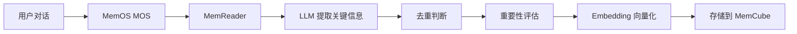

# MemOS 完整框架使用说明

## 🎯 完整 vs 简化版本对比

### 完整框架版（推荐）

**文件**: `memos_api_server_full.py`

**功能**:
- ✅ 使用完整 MemOS 框架（MOS + MemReader）
- ✅ **自动记忆加工**（LLM 提取关键信息）
- ✅ 记忆去重和合并
- ✅ 重要性评估
- ✅ 更智能的检索策略
- ✅ 支持未来扩展（生命周期、调度器等）

**适合**: 需要完整记忆管理功能的场景

### 简化版

**文件**: `memos_api_server.py`

**功能**:
- ✅ 基础记忆存储和检索
- ✅ 向量相似度搜索
- ⚠️ 无自动加工（需手动调用）
- ⚠️ 无去重机制

**适合**: 快速测试或轻量级场景

---

## 🚀 启动完整框架版

### 方式1：通过启动脚本（推荐）

```
双击: MEMOS-API.bat
选择: 1 (完整框架版)
```

### 方式2：直接启动

```batch
cd K:\neruo\my-neuro-main
conda activate my-neuro
python memos_api_server_full.py
```

---

## ✨ 完整框架的记忆加工流程



### 加工示例

**输入**:
```
用户：我今天去踢足球了，感觉非常开心，天气很好，下次还想去，而且认识了几个新朋友
AI：踢球不错啊，注意安全
```

**完整框架加工后**:
```
用户今天踢足球感到开心；认识了新朋友；计划下次再去
```

**简化版**:
```
（直接存储原文，无加工）
```

---

## 📊 完整框架启动日志

启动成功后您会看到：

```
============================================================
  启动 MemOS 完整框架服务
============================================================

📦 加载 Embedding 模型...
✅ Embedder 创建成功: ./RAG-model

🤖 配置记忆加工 LLM...
✅ LLM 创建成功: zai-org/GLM-4.6

⚙️ 创建 MOS 配置...
✅ MOSConfig 创建成功

🚀 初始化 MOS...
✅ MOS 实例创建成功

👤 创建用户: feiniu_default
✅ 用户创建成功

============================================================
  ✅ MemOS 完整框架启动成功!
============================================================
  📍 用户ID: feiniu_default
  🧠 Embedding: ./RAG-model
  🤖 记忆加工: zai-org/GLM-4.6
  🔧 完整框架功能已启用
============================================================
```

---

## 🔧 配置文件说明

### memos_config.json (当前未使用)

完整框架版**不使用** JSON 配置文件，而是在代码中程序化配置（`memos_api_server_full.py` 第43-57行）。

这样做的好处：
- 避免复杂的 JSON 配置格式
- 更灵活的参数控制
- 更好的错误提示

---

## ⚙️ 修改配置

如需调整，编辑 `memos_api_server_full.py`：

```python
# 第48行附近 - LLM 配置
llm_config = OpenAILLMConfig(
    model_name_or_path="zai-org/GLM-4.6",  # 模型名称
    api_key="your_api_key",                # API Key
    api_base="https://api.siliconflow.cn/v1",  # API 地址
    temperature=0.2,                       # 温度（0.1-1.0）
    max_tokens=200                         # 最大 token
)

# 第62行附近 - MOS 配置
mos_config = MOSConfig(
    chat_model=llm_config,
    enable_textual_memory=True,   # 文本记忆
    enable_activation_memory=False,  # KV Cache（暂不启用）
    enable_parametric_memory=False,  # 参数记忆（暂不启用）
    top_k=5                       # 默认检索数量
)
```

---

## 🎯 完整框架的优势

### 1. 智能记忆加工
```
原文: 我今天去公园跑步了，天气很好，跑了5公里，感觉很累但很开心
加工: 用户今天在公园跑步5公里，感到疲惫但开心
```

### 2. 自动去重
```
已有: 用户喜欢足球
新增: 用户很喜欢踢足球
→ 自动识别为相似记忆，进行合并
```

### 3. 重要性评估
```
"用户生日是5月1日" → 重要度: 高
"用户说今天天气不错" → 重要度: 低
```

---

## 🔍 API 端点（完整版）

| 端点 | 功能 |
|-----|------|
| `POST /add` | 添加记忆（自动加工） |
| `POST /search` | 搜索记忆（MOS 检索） |
| `GET /list` | 列出所有记忆 |
| `POST /migrate` | 导入旧记忆（自动加工） |
| `GET /stats` | 统计信息 |
| `GET /health` | 健康检查 |

---

## ⚠️ 注意事项

### API 调用费用
完整框架会对**每条新记忆**调用 LLM 进行加工：
- 导入 100 条记忆 ≈ 调用 100 次 API
- 建议使用便宜的模型（如 gpt-4o-mini, deepseek-chat）

### 性能
- 记忆加工需要时间（每条约 1-3 秒）
- 导入大量记忆时请耐心等待

---

## 🚀 推荐使用流程

1. **启动完整框架版**: 选择 1
2. **导入旧记忆**: 会自动加工所有记忆
3. **日常使用**: 新对话自动加工并存储

---

**完整框架版已就绪！** 🎉

